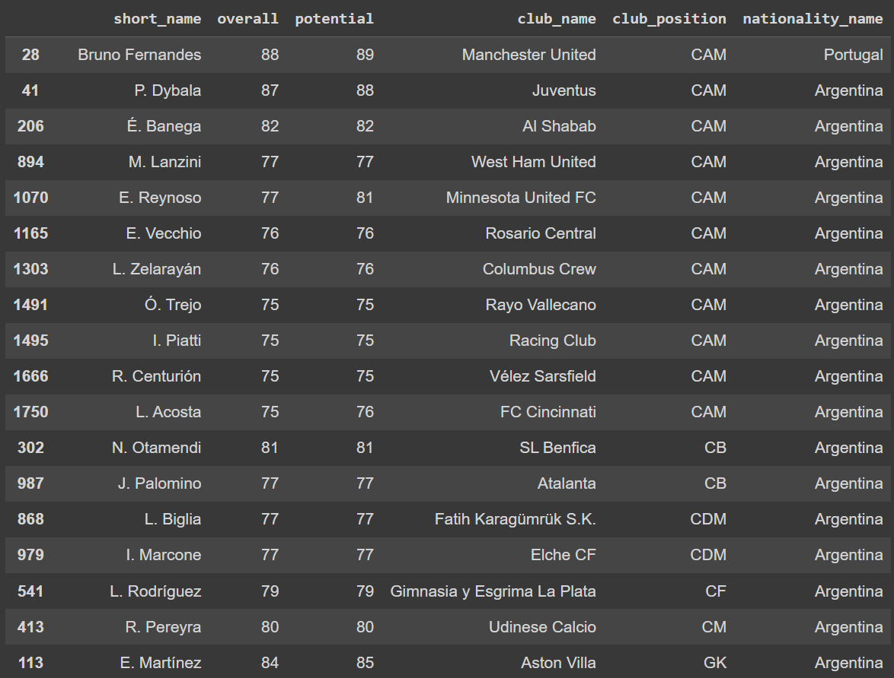

# Week 9 Mini Project
The purpose of this project is to perform data manipulation tasks on a chosen data set in a cloud-hosted Jupyter notebook. I used Google Colab, and the notebook is linked below:

https://colab.research.google.com/drive/13luxXCIeovBdavqKa5suTCd_IGpOj0Nr#scrollTo=JSgNbzJ0QXDg

# Documentation of Data Manipulation Tasks

The sample data contains information on all players in the video game FIFA 22, including player ratings, teams, nationalities, positions, etc. For the data manipulation, I am interested in comparing the ratings of players from Portugal and Argentina. Thus, I subset the data to players from these two nations and keep only the columns I am interested in.

Now, to make the data more organized and readable, and to make comparisons between Argentinian and Portuguese players position-wise, I sort the abridged data by ascending alphabetical club position and descending rating.

